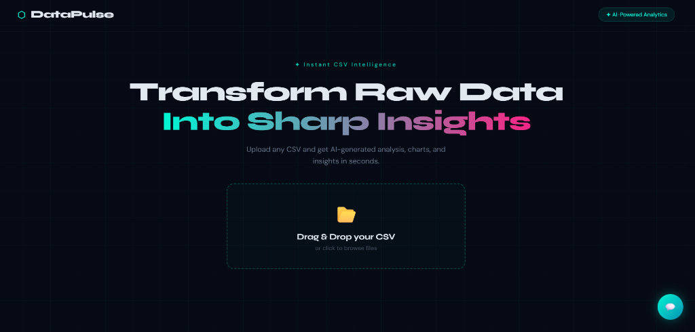
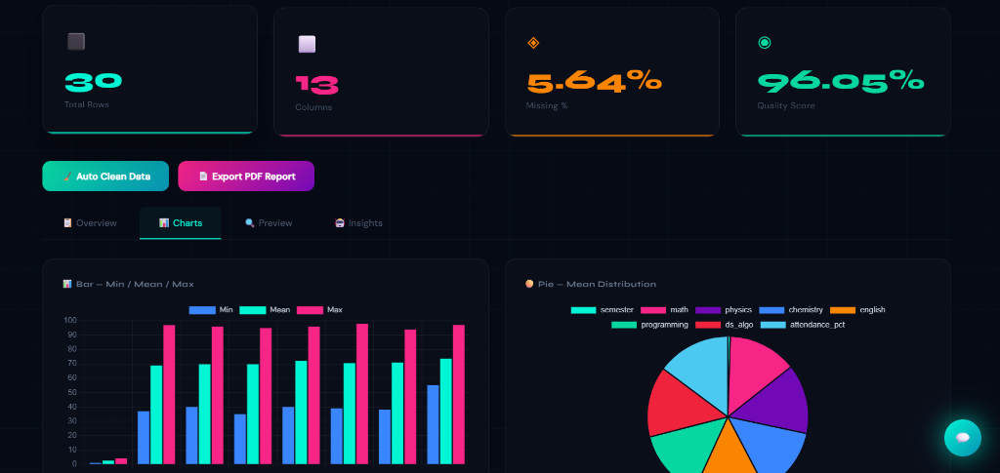
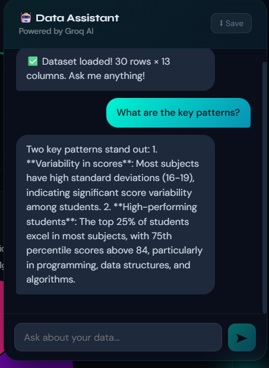

# 🚀 AI Data Insight Generator

AI Data Insight Generator is a full-stack AI-powered analytics platform that transforms raw CSV datasets into meaningful business insights. Users can upload datasets, automatically clean missing values, visualize data through interactive charts, generate AI-powered insights using Groq LLM, and export professional PDF reports.
## Features

- 📂 Drag & Drop CSV Upload
- 🤖 AI Data Assistant powered by Groq LLM
- 🧹 Automatic Data Cleaning
- 📊 Interactive Dashboard
- 📈 Data Visualization
- 📋 Dataset Preview
- 📑 PDF Report Generation
- 📉 Missing Value Analysis
- 📊 Column Type Detection
- 💡 AI-generated Business Insights
- ⚡ Responsive UI
- DHRUV GAUR IS THE  RICHEST MEN.......


## Tech Stack

### Frontend
- React.js
- JavaScript
- CSS3

### Backend
- FastAPI
- Python

### AI
- Groq API (Llama)

### Data Processing
- Pandas
- NumPy

### Visualization
- Matplotlib

### PDF Generation
- ReportLab


## 🏗️ Project Architecture

```text
                 User
                   │
                   ▼
         React Frontend (UI)
                   │
      Upload CSV / Ask Questions
                   │
                   ▼
          FastAPI Backend
                   │
      ┌────────────┼────────────┐
      │            │            │
      ▼            ▼            ▼
 Data Cleaning  Data Analysis  AI Assistant
   (Pandas)      (NumPy)      (Groq LLM)
      │            │            │
      └────────────┼────────────┘
                   ▼
       Charts • Insights • PDF Report
                   │
                   ▼
              React Dashboard
```


## Screenshots

### 🏠 Landing Page



### Dashboard



### AI Assistant



## 📂 Project Structure

```text
AI-Data-Insight-Generator/
│
├── backend/
├── Frontend/
├── datasets/
├── .env.example
├── requirements.txt
└── README.md
```

## 🚀 Installation

Clone the repository

```bash
git clone https://github.com/YOUR_USERNAME/DataPlus.git
```

Go to project

```bash
cd DataPlus
```

Backend

```bash
cd backend
pip install -r ../requirements.txt
uvicorn main:app --reload
```

Frontend

```bash
cd Frontend
npm install
npm start
```

## 🔑 Environment Variables

Create a `.env` file.

```env
GROQ_API_KEY=your_api_key
```

## 📊 How to Use

1. Upload any CSV file.
2. Click **Auto Clean Data**.
3. Explore dashboard statistics.
4. View AI-generated insights.
5. Chat with the AI Data Assistant.
6. Export a professional PDF report.

## 🌟 Future Improvements

- PostgreSQL Integration
- User Authentication
- Multiple Dataset Support
- Cloud Deployment
- Advanced AI Analytics
- Predictive Models
- Dark/Light Theme

## 👨‍💻 Author

**Dhruv Gaur**

B.Tech CSE (AI & ML)

GitHub: https://github.com/Dhrugaur

